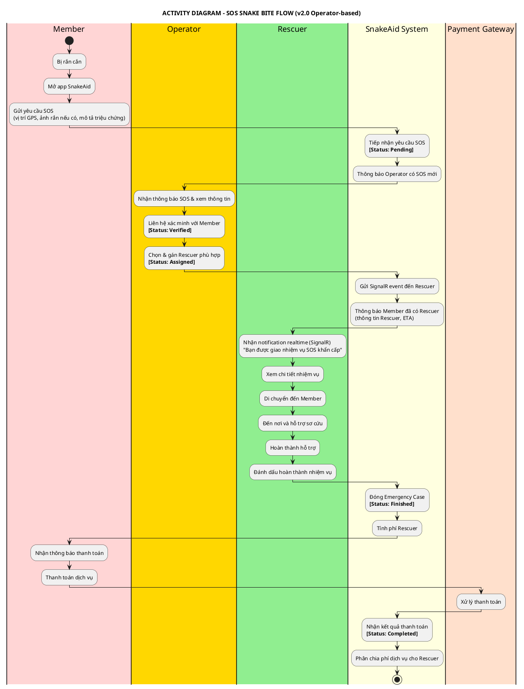
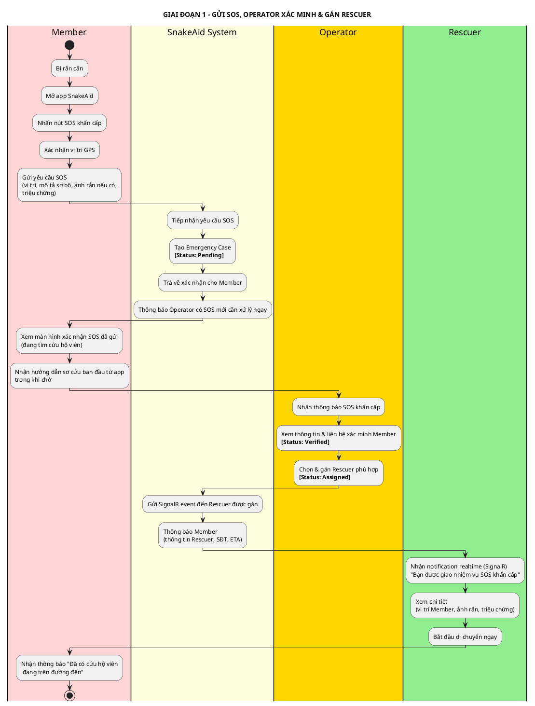
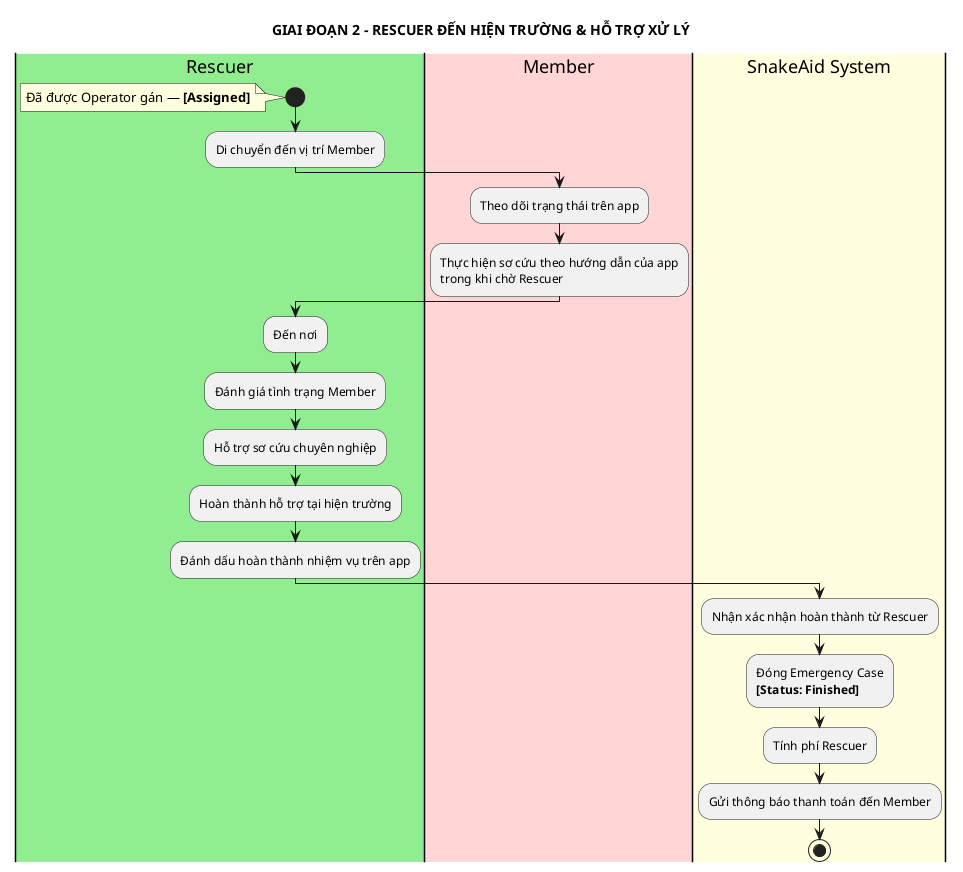
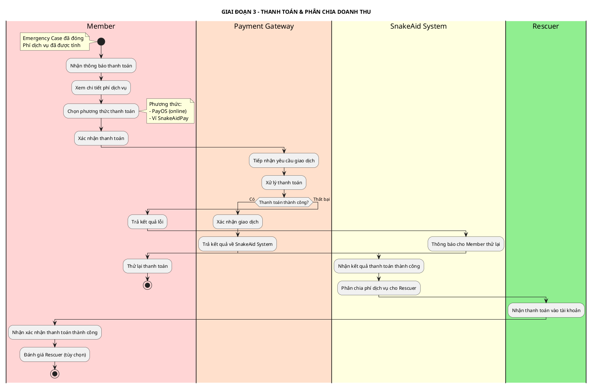

# ACTIVITY DIAGRAM - LUỒNG SOS KHẨN CẤP RẮN CẮN

## Thông tin tài liệu
- **Tên dự án:** AI-Powered Platform for Snakebite First Aid and Rescue Support (SnakeAid)
- **Module:** SOS Emergency — Snakebite Response
- **Phiên bản:** 2.0
- **Ngày tạo:** 10/03/2026
- **Cập nhật:** 11/04/2026 — Chuyển sang mô hình vận hành tập trung (Operator-based), tương tự Snake Catching v2.0
- **Mục đích:** Mô tả luồng nghiệp vụ chính khi bệnh nhân bị rắn cắn khẩn cấp với sự tham gia của các Actor

---

## ACTORS

| Actor | Vai trò |
|---|---|
| **Member** | Nạn nhân bị rắn cắn, kích hoạt SOS, nhận hỗ trợ và thanh toán dịch vụ sau khi hoàn thành |
| **Operator** | Nhân viên điều phối xác minh yêu cầu SOS, liên hệ nạn nhân và gán cứu hộ viên |
| **Rescuer** | Cứu hộ viên được Operator giao nhiệm vụ, di chuyển đến hiện trường, hỗ trợ sơ cứu cho Member |
| **SnakeAid System** | Nền tảng trung gian: tiếp nhận SOS, thông báo Operator, tính phí, phân chia doanh thu |
| **Payment Gateway** | Cổng thanh toán xử lý giao dịch dịch vụ từ Member |

> **Thay đổi mô hình (v2.0):** Rescuer không còn tự nhận đơn SOS. Operator là đầu mối duy nhất xác minh và phân công. Mobile nhận kết quả qua SignalR.

---

## ACTIVITY DIAGRAM TỔNG QUAN



---

## ACTIVITY DIAGRAM CHI TIẾT THEO GIAI ĐOẠN

### Giai đoạn 1: Gửi SOS, Operator xác minh & Gán Rescuer



---

### Giai đoạn 2: Rescuer đến hiện trường & Hỗ trợ xử lý



---

### Giai đoạn 3: Thanh toán & Phân chia doanh thu



---

## TỔNG HỢP TRẠNG THÁI EMERGENCY CASE

```plantuml
@startuml Emergency-Status-Flow
title LUỒNG TRẠNG THÁI EMERGENCY CASE (v2.0)

[*] --> Pending : Member gửi SOS

Pending --> Verified : Operator xác minh
(đã liên hệ nạn nhân)
Pending --> Cancelled : Hủy (sai / giả)

Verified --> Assigned : Operator gán Rescuer
(SignalR → Rescuer app)
Verified --> Cancelled : Không tìm được Rescuer

Assigned --> InProgress : Rescuer đang di chuyển
/ đang hỗ trợ tại hiện trường
InProgress --> Finished : Rescuer hoàn thành hỗ trợ

Finished --> Completed : Member thanh toán thành công

Cancelled --> [*]
Completed --> [*]

note right of Assigned
  Mission sub-statuses:
  Preparing → EnRoute → Arrived → MissionCompleted
end note

note right of InProgress
  Rescuer đang hỗ trợ
  tại hiện trường
end note

note right of Finished
  SnakeAid System tính phí Rescuer
  → Gửi thông báo thanh toán cho Member
end note

@enduml
```

---

## GHI CHÚ NGHIỆP VỤ

### Thay đổi mô hình v2.0 (Operator-based)
| Tính năng | v1.1 (cũ) | v2.0 (hiện tại) |
|---|---|---|
| Phân công Rescuer | Hệ thống broadcast alert, Rescuer tự nhận | Operator xác minh và gán trực tiếp |
| Trạng thái trung gian | Không có | `Verified` (Operator xác minh với nạn nhân) |
| Thông báo Rescuer | Push notification broadcast | SignalR event chỉ định |
| Khả năng hủy broadcast | Không có | Operator có thể hủy nếu SOS giả |

### Quy tắc thanh toán SOS
| Yếu tố | Chi tiết |
|---|---|
| **Thời điểm thanh toán** | Sau khi Rescuer hoàn thành hỗ trợ (`Finished`) — post-service, 100% |
| **Thành phần phí** | Phí Rescuer |
| **Phương thức** | PayOS hoặc Ví SnakeAidPay |
| **Phân chia** | SnakeAid System phân chia tự động sau khi nhận thanh toán |

### Vai trò Operator trong SOS
- Operator nhận thông báo ưu tiên cao ngay khi có SOS mới
- Operator **liên hệ xác minh** với Member (loại trừ SOS giả)
- Operator cập nhật trạng thái `Verified` rồi **chọn và gán** Rescuer phù hợp
- Rescuer nhận nhiệm vụ qua **SignalR event chỉ định** — không tự nhận
