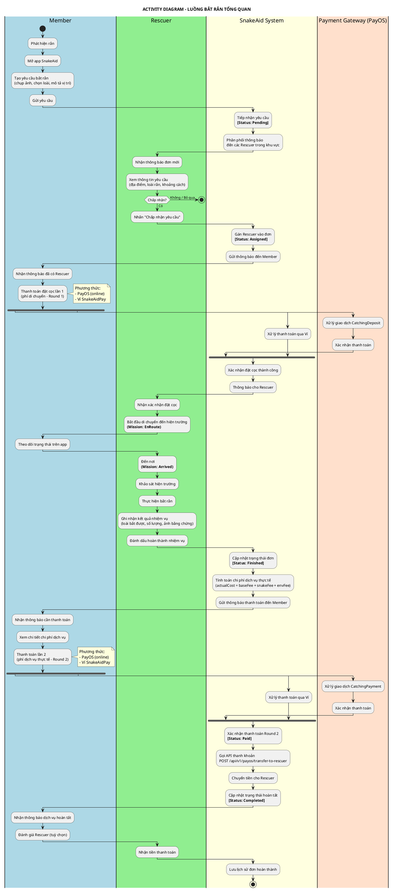
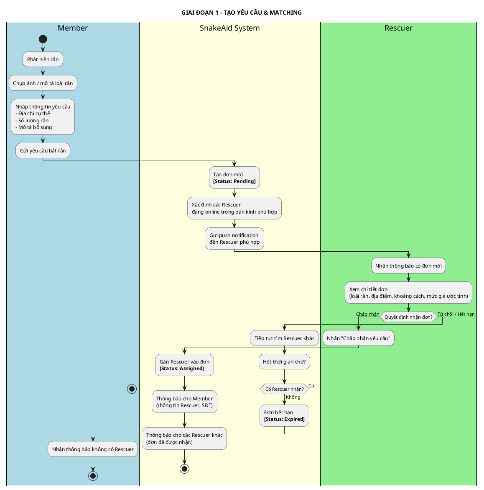
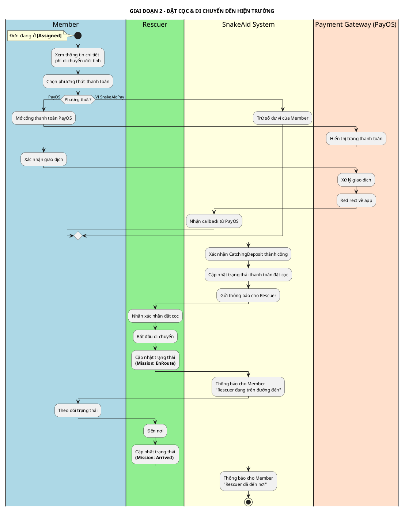
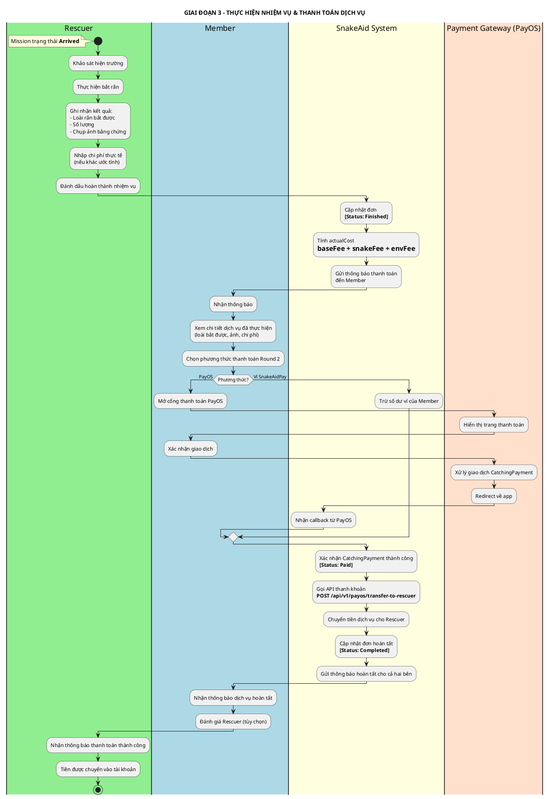
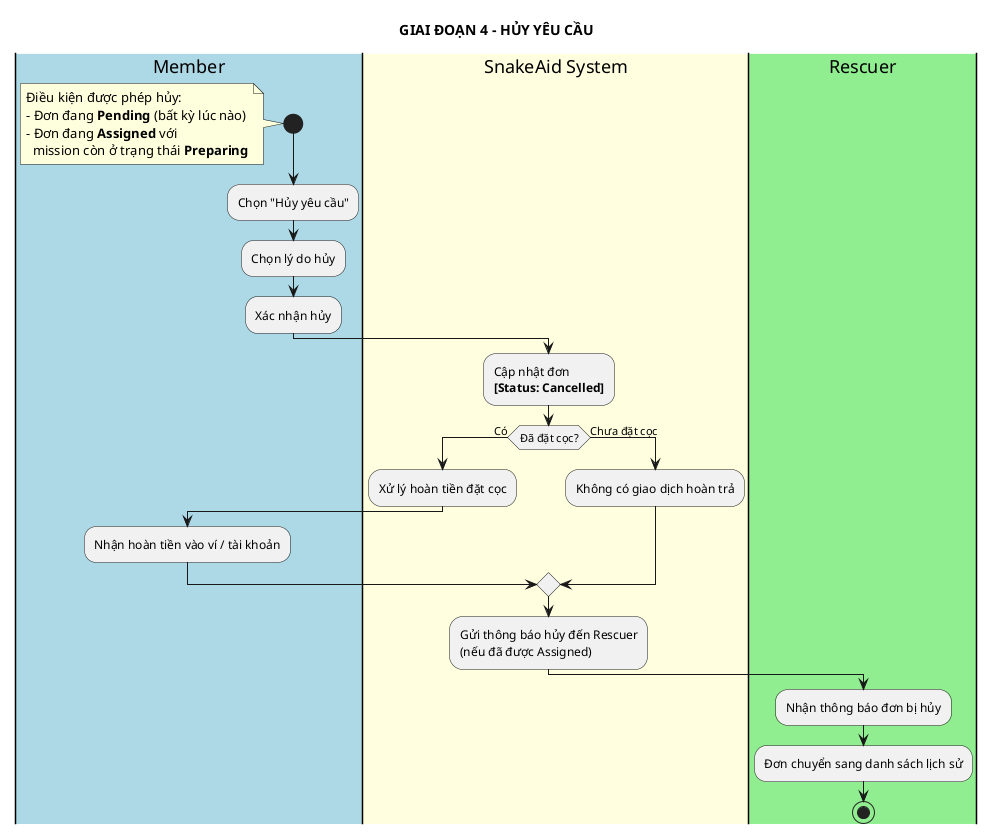
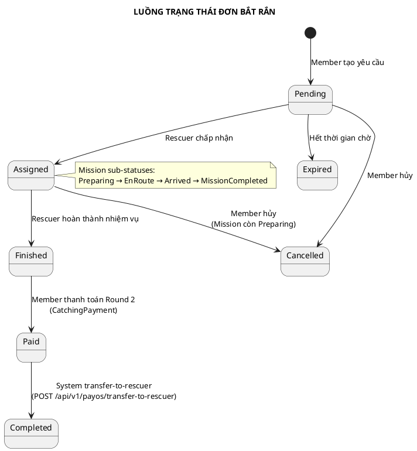

# ACTIVITY DIAGRAM - LUỒNG BẮT RẮN (SNAKE CATCHING)

## Thông tin tài liệu
- **Tên dự án:** AI-Powered Platform for Snakebite First Aid and Rescue Support (SnakeAid)
- **Module:** Snake Catching Request
- **Phiên bản:** 1.0
- **Ngày tạo:** 10/03/2026
- **Mục đích:** Mô tả luồng nghiệp vụ chính của dịch vụ bắt rắn với sự tham gia của các Actor

---

## ACTORS

| Actor | Vai trò |
|---|---|
| **Member** | Người dùng phát hiện rắn, tạo yêu cầu và thanh toán dịch vụ |
| **Rescuer** | Cứu hộ viên tiếp nhận và thực hiện nhiệm vụ bắt rắn |
| **SnakeAid System** | Nền tảng trung gian xử lý matching, thông báo, và thanh khoản |
| **Payment Gateway (PayOS)** | Cổng thanh toán trực tuyến (kênh thanh toán tùy chọn) |

---

## ACTIVITY DIAGRAM TỔNG QUAN

---

## ACTIVITY DIAGRAM CHI TIẾT THEO GIAI ĐOẠN

### Giai đoạn 1: Tạo yêu cầu & Matching

---

### Giai đoạn 2: Thanh toán đặt cọc & Di chuyển

---

### Giai đoạn 3: Thực hiện nhiệm vụ & Thanh toán dịch vụ

---

### Giai đoạn 4: Luồng hủy đơn

---

## TỔNG HỢP CÁC TRẠNG THÁI ĐƠN

---

## GHI CHÚ NGHIỆP VỤ

### Quy tắc thanh toán 2 vòng
| Vòng | Thời điểm | Loại giao dịch | Nội dung |
|---|---|---|---|
| Round 1 | Sau khi Rescuer nhận đơn (Assigned) | `CatchingDeposit` | Phí di chuyển ước tính |
| Round 2 | Sau khi Rescuer hoàn thành (Finished) | `CatchingPayment` | Phí dịch vụ thực tế (baseFee + snakeFee + envFee) |

### Thanh khoản cho Rescuer
- Sau khi Member thanh toán Round 2 thành công → đơn chuyển sang `[Paid]`
- System tự động gọi `POST /api/v1/payos/transfer-to-rescuer`
- Rescuer nhận toàn bộ phí dịch vụ → đơn chuyển sang `[Completed]`

### Quyền hủy đơn
- Trạng thái `Pending`: Member được hủy tự do
- Trạng thái `Assigned` & Mission = `Preparing`: Member được hủy (Rescuer chưa di chuyển)
- Trạng thái `Assigned` & Mission = `EnRoute/Arrived`: **Không** được hủy
