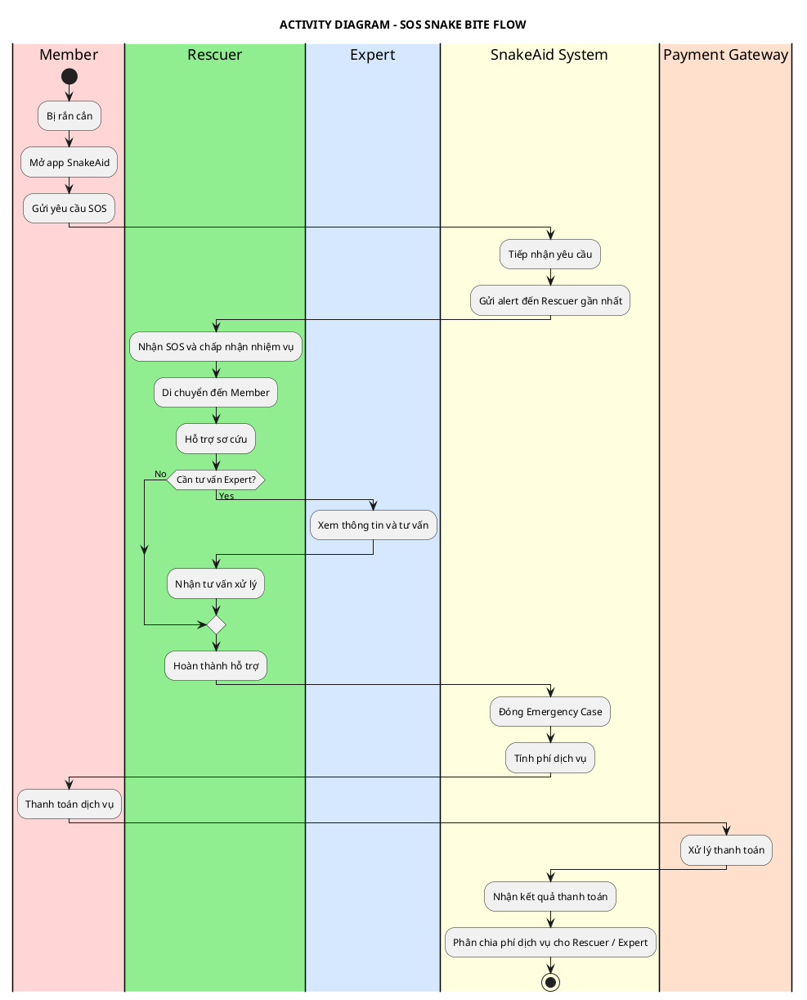
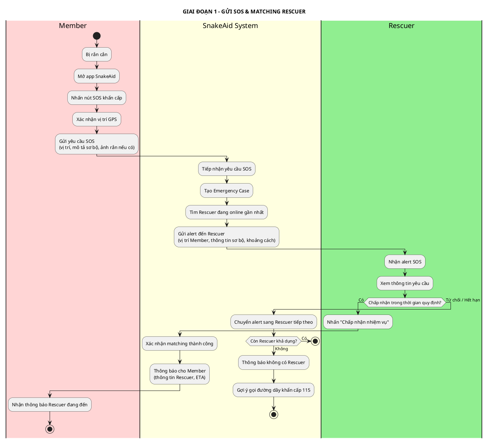
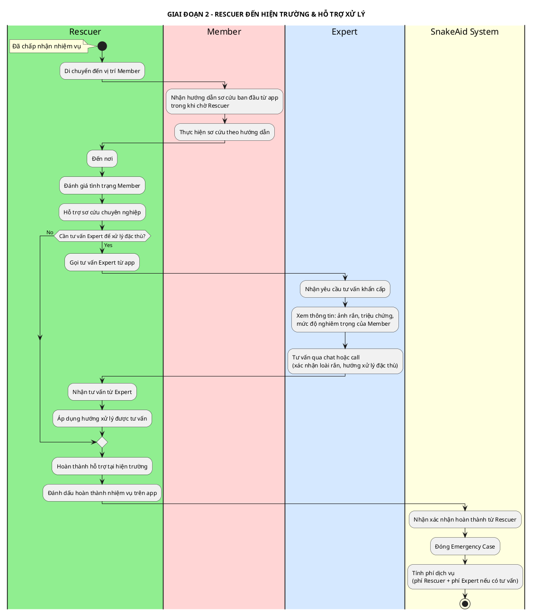
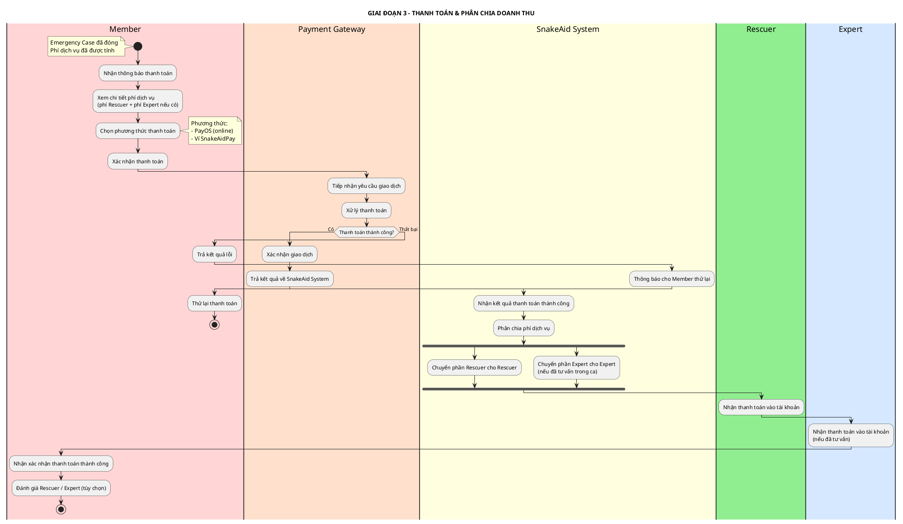
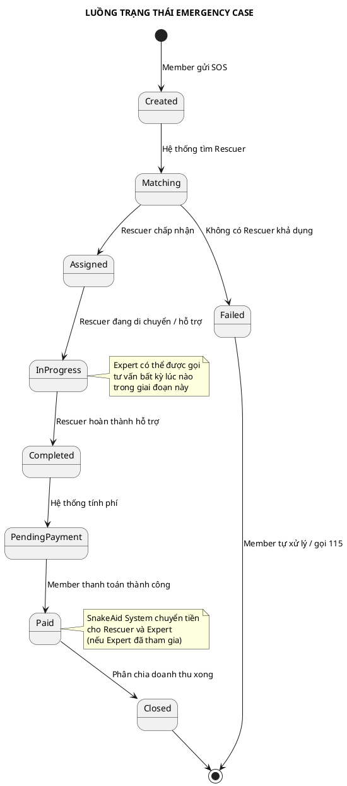

# ACTIVITY DIAGRAM - LUỒNG SOS KHẨN CẤP RẮN CẮN

## Thông tin tài liệu
- **Tên dự án:** AI-Powered Platform for Snakebite First Aid and Rescue Support (SnakeAid)
- **Module:** SOS Emergency — Snakebite Response
- **Phiên bản:** 1.1
- **Ngày tạo:** 10/03/2026
- **Mục đích:** Mô tả luồng nghiệp vụ chính khi bệnh nhân bị rắn cắn khẩn cấp với sự tham gia của các Actor

---

## ACTORS

| Actor | Vai trò |
|---|---|
| **Member** | Nạn nhân bị rắn cắn, kích hoạt SOS, nhận hỗ trợ và thanh toán dịch vụ sau khi hoàn thành |
| **Rescuer** | Cứu hộ viên tiếp nhận SOS, di chuyển đến hiện trường, hỗ trợ sơ cứu cho Member |
| **Expert** | Chuyên gia tư vấn từ xa (tuỳ chọn) khi Rescuer cần xác định loài rắn hoặc hướng xử lý đặc thù |
| **SnakeAid System** | Nền tảng trung gian: tiếp nhận SOS, matching Rescuer, tính phí, phân chia doanh thu |
| **Payment Gateway** | Cổng thanh toán xử lý giao dịch dịch vụ từ Member |

---

## ACTIVITY DIAGRAM TỔNG QUAN

---

## ACTIVITY DIAGRAM CHI TIẾT THEO GIAI ĐOẠN

### Giai đoạn 1: Gửi SOS & Matching Rescuer

---

### Giai đoạn 2: Rescuer đến hiện trường & Hỗ trợ xử lý

---

### Giai đoạn 3: Thanh toán & Phân chia doanh thu

---

## TỔNG HỢP TRẠNG THÁI EMERGENCY CASE

---

## GHI CHÚ NGHIỆP VỤ

### Quy tắc thanh toán SOS
| Yếu tố | Chi tiết |
|---|---|
| **Thời điểm thanh toán** | Sau khi Rescuer hoàn thành hỗ trợ (post-service, 100%) |
| **Thành phần phí** | Phí Rescuer + Phí Expert (nếu có tư vấn trong ca) |
| **Phương thức** | PayOS hoặc Ví SnakeAidPay |
| **Phân chia** | SnakeAid System phân chia tự động sau khi nhận thanh toán từ Payment Gateway |

### Vai trò Expert trong SOS
- Expert **không** tham gia mặc định — chỉ khi Rescuer chủ động gọi trong lúc thực hiện nhiệm vụ
- Tư vấn **từ xa** (không đến hiện trường)
- Phí tư vấn Expert **gộp chung** vào hóa đơn cuối của Member
- Phí Expert được **SnakeAid System phân chia** sau khi nhận thanh toán thành công
