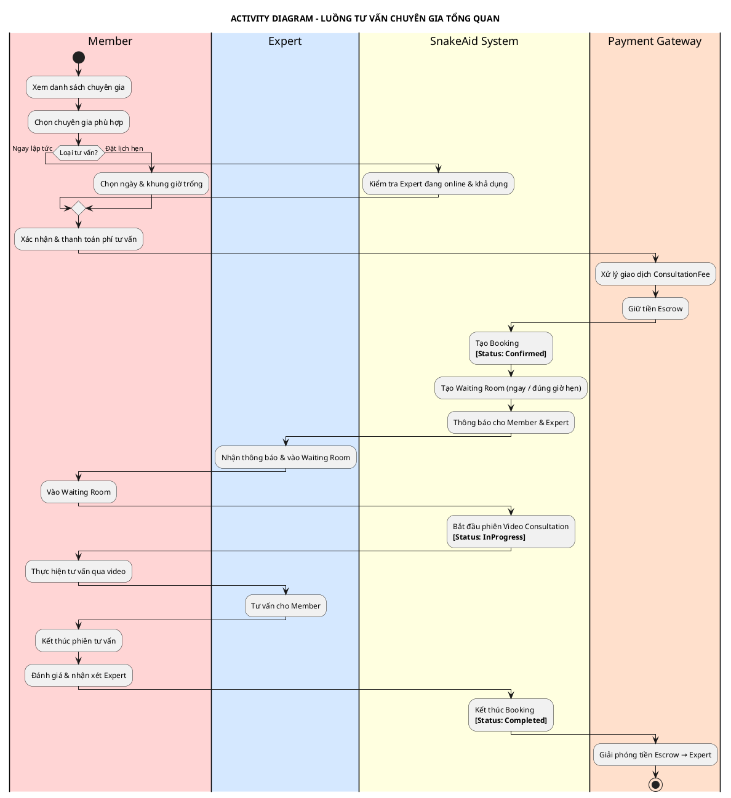
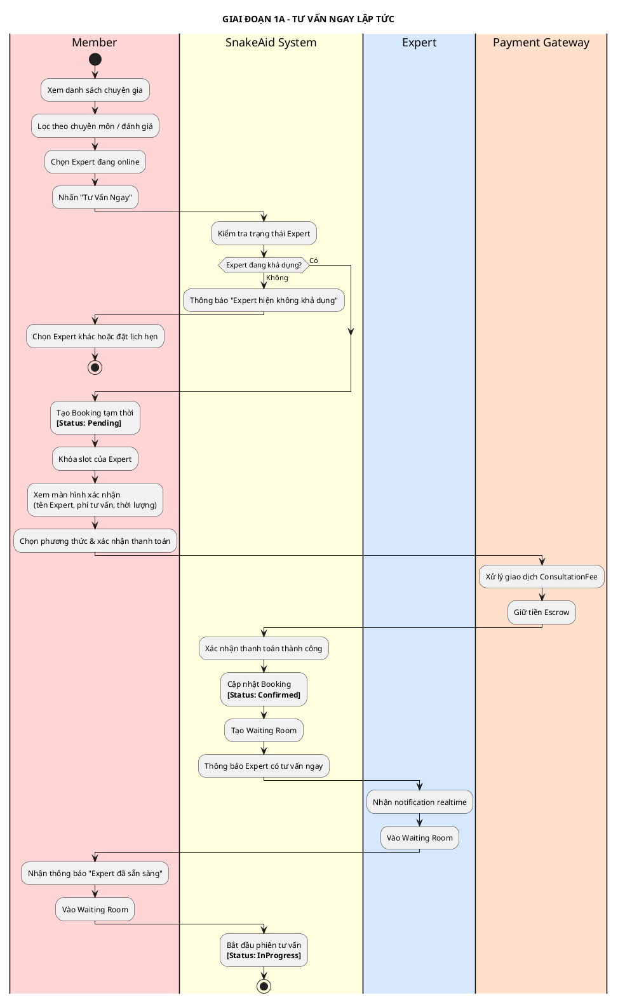
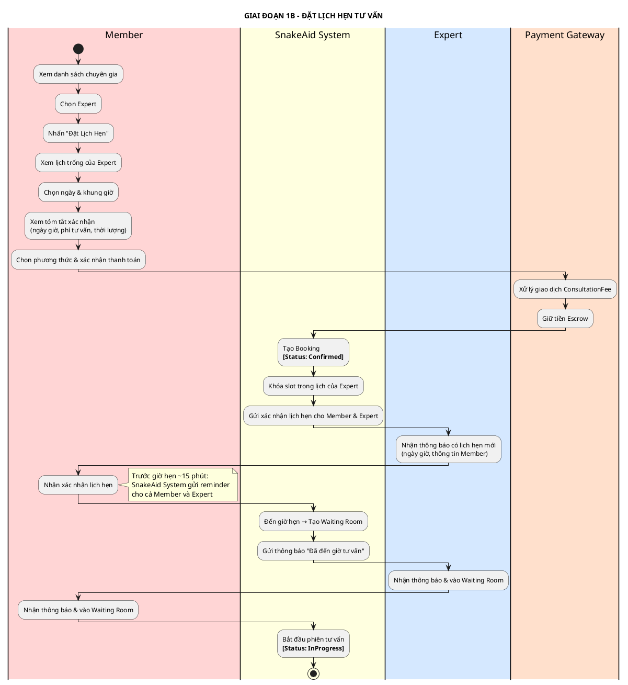
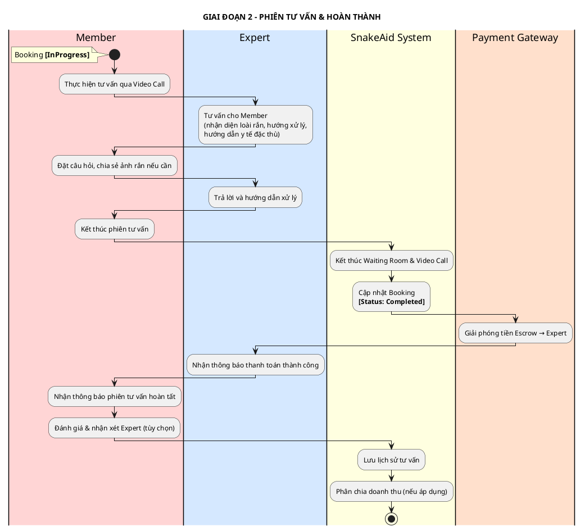
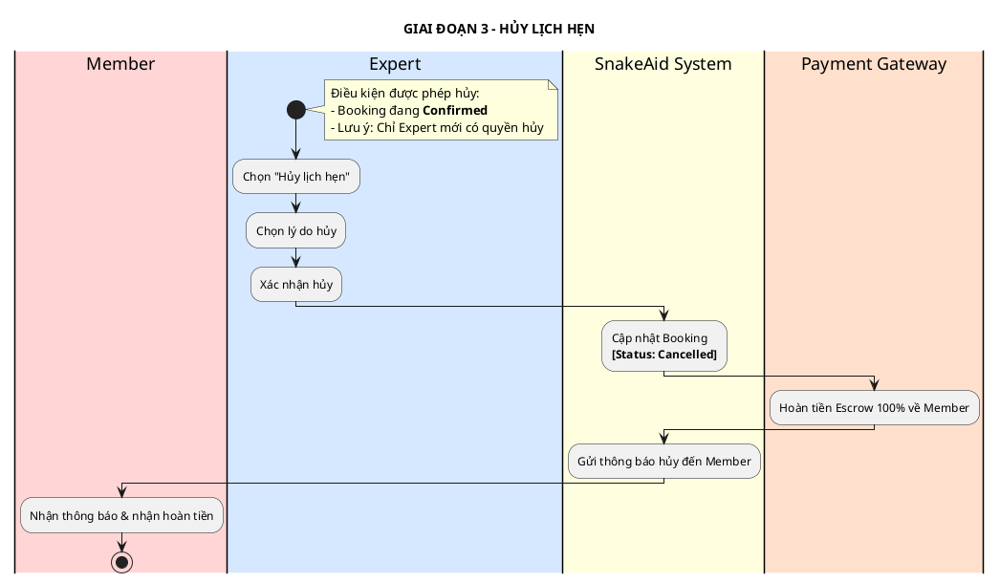
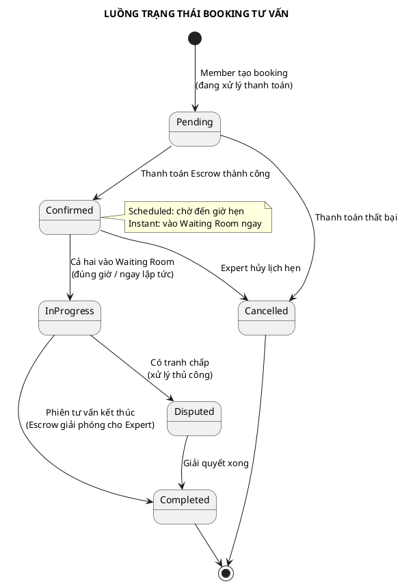

# ACTIVITY DIAGRAM - LUỒNG TƯ VẤN CHUYÊN GIA (CONSULTATION)

## Thông tin tài liệu
- **Tên dự án:** AI-Powered Platform for Snakebite First Aid and Rescue Support (SnakeAid)
- **Module:** Expert Consultation — Tư vấn trực tiếp & Đặt lịch hẹn
- **Phiên bản:** 1.0
- **Ngày tạo:** 11/04/2026
- **Mục đích:** Mô tả luồng nghiệp vụ chính của dịch vụ tư vấn chuyên gia (ngay lập tức và đặt lịch hẹn) với sự tham gia của các Actor

---

## ACTORS

| Actor | Vai trò |
|---|---|
| **Member** | Người dùng tìm kiếm tư vấn, đặt lịch / tư vấn ngay và thanh toán phí dịch vụ |
| **Expert** | Chuyên gia thực hiện tư vấn qua video call, nhận phí sau khi phiên hoàn thành |
| **SnakeAid System** | Nền tảng trung gian quản lý booking, phòng chờ, trạng thái và phân chia doanh thu |
| **Payment Gateway** | Cổng thanh toán xử lý giao dịch và giữ tiền Escrow đến khi tư vấn hoàn thành |

---

## ACTIVITY DIAGRAM TỔNG QUAN

---

## ACTIVITY DIAGRAM CHI TIẾT THEO GIAI ĐOẠN

### Giai đoạn 1A: Tư vấn ngay lập tức

---

### Giai đoạn 1B: Đặt lịch hẹn

---

### Giai đoạn 2: Diễn ra phiên tư vấn & Hoàn thành

---

### Giai đoạn 3: Hủy lịch hẹn

---

## TỔNG HỢP CÁC TRẠNG THÁI BOOKING

---

## GHI CHÚ NGHIỆP VỤ

### So sánh 2 loại tư vấn
| Tiêu chí | Tư vấn ngay (Instant) | Đặt lịch hẹn (Scheduled) |
|---|---|---|
| Điều kiện | Expert đang online & khả dụng | Expert có slot trống |
| Thời gian bắt đầu | Ngay lập tức | Theo lịch đã đặt |
| Thanh toán | Trước khi vào Waiting Room | Khi xác nhận đặt lịch |
| Hủy | Chỉ Expert được hủy (Member không có quyền) | Chỉ Expert được hủy (Member không có quyền) |

### Cơ chế thanh toán Escrow
| Bước | Thời điểm | Hành động |
|---|---|---|
| Giữ tiền | Khi Booking `Confirmed` | Payment Gateway khóa tiền của Member |
| Giải phóng | Khi Booking `Completed` | Chuyển cho Expert sau khi tư vấn xong |
| Hoàn trả | Khi Booking `Cancelled` (do Expert hủy) | Hoàn 100% về ví / tài khoản Member |

### Quy tắc hủy & hoàn tiền
- **Member không được phép hủy lịch hẹn** (trên UI Member không có tính năng Hủy).
- **Expert hủy lịch**: Hoàn tiền **100%** cho Member.
- Không được hủy khi Booking đang `InProgress`

---

