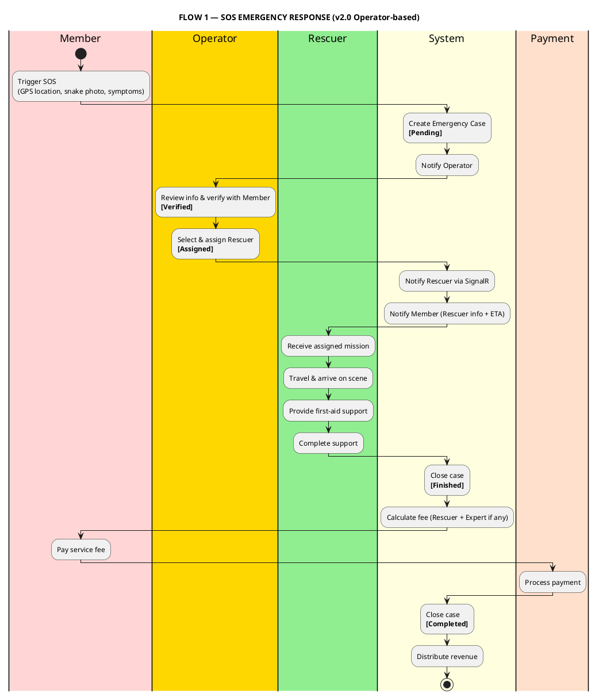
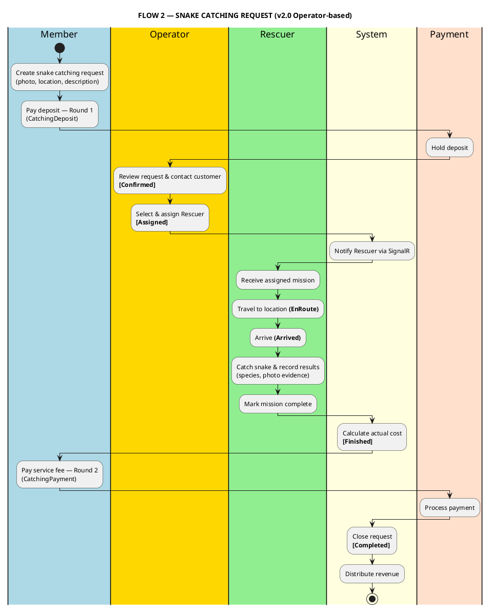
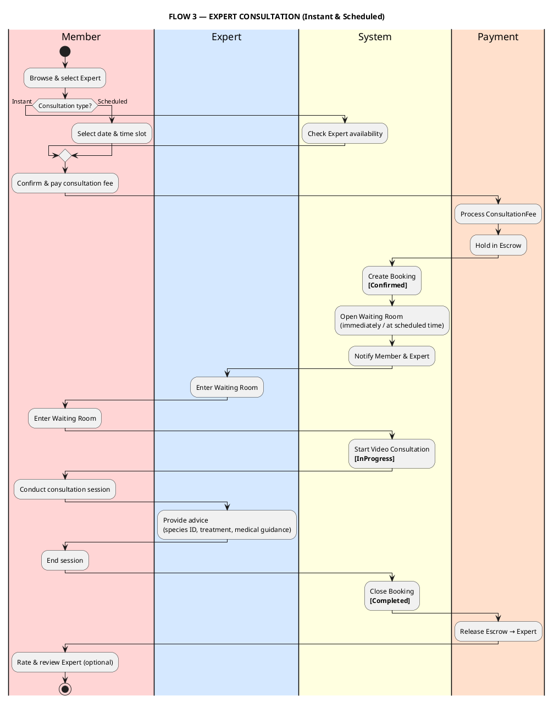

## ENGLISH SUMMARY — 3 MAIN FLOWS

### Flow 1: SOS Emergency Response

```plantuml
@startuml Summary-Flow2-SOSEmergency
title FLOW 1 — SOS EMERGENCY RESPONSE (v2.0 Operator-based)

|#FFD5D5|Member|
|#FFD700|Operator|
|#LightGreen|Rescuer|
|#LightYellow|System|
|#FFE0CC|Payment|

|Member|
start
:Trigger SOS\n(GPS location, snake photo, symptoms);

|System|
:Create Emergency Case\n**[Pending]**;
:Notify Operator;

|Operator|
:Review info & verify with Member\n**[Verified]**;
:Select & assign Rescuer\n**[Assigned]**;

|System|
:Notify Rescuer via SignalR;
:Notify Member (Rescuer info + ETA);

|Rescuer|
:Receive assigned mission;
:Travel & arrive on scene;
:Provide first-aid support;
:Complete support;

|System|
:Close case\n**[Finished]**;
:Calculate fee (Rescuer + Expert if any);

|Member|
:Pay service fee;

|Payment|
:Process payment;

|System|
:Close case\n**[Completed]**;
:Distribute revenue;

stop
@enduml
```

---

### Flow 2: Snake Catching Request

```plantuml
@startuml Summary-Flow1-SnakeCatching
title FLOW 2 — SNAKE CATCHING REQUEST (v2.0 Operator-based)

|#LightBlue|Member|
|#FFD700|Operator|
|#LightGreen|Rescuer|
|#LightYellow|System|
|#FFE0CC|Payment|

|Member|
start
:Create snake catching request\n(photo, location, description);
:Pay deposit — Round 1\n(CatchingDeposit);

|Payment|
:Hold deposit;

|Operator|
:Review request & contact customer\n**[Confirmed]**;
:Select & assign Rescuer\n**[Assigned]**;

|System|
:Notify Rescuer via SignalR;

|Rescuer|
:Receive assigned mission;
:Travel to location **(EnRoute)**;
:Arrive **(Arrived)**;
:Catch snake & record results\n(species, photo evidence);
:Mark mission complete;

|System|
:Calculate actual cost\n**[Finished]**;

|Member|
:Pay service fee — Round 2\n(CatchingPayment);

|Payment|
:Process payment;

|System|
:Close request\n**[Completed]**;
:Distribute revenue;

stop
@enduml
```

---

### Flow 3: Expert Consultation

```plantuml
@startuml Summary-Flow3-Consultation
title FLOW 3 — EXPERT CONSULTATION (Instant & Scheduled)

|#FFD5D5|Member|
|#D5E8FF|Expert|
|#LightYellow|System|
|#FFE0CC|Payment|

|Member|
start
:Browse & select Expert;

if (Consultation type?) then (Instant)
  |System|
  :Check Expert availability;
  |Member|
else (Scheduled)
  |Member|
  :Select date & time slot;
endif

:Confirm & pay consultation fee;

|Payment|
:Process ConsultationFee;
:Hold in Escrow;

|System|
:Create Booking\n**[Confirmed]**;
:Open Waiting Room\n(immediately / at scheduled time);
:Notify Member & Expert;

|Expert|
:Enter Waiting Room;

|Member|
:Enter Waiting Room;

|System|
:Start Video Consultation\n**[InProgress]**;

|Member|
:Conduct consultation session;

|Expert|
:Provide advice\n(species ID, treatment, medical guidance);

|Member|
:End session;

|System|
:Close Booking\n**[Completed]**;

|Payment|
:Release Escrow → Expert;

|Member|
:Rate & review Expert (optional);

stop
@enduml
```