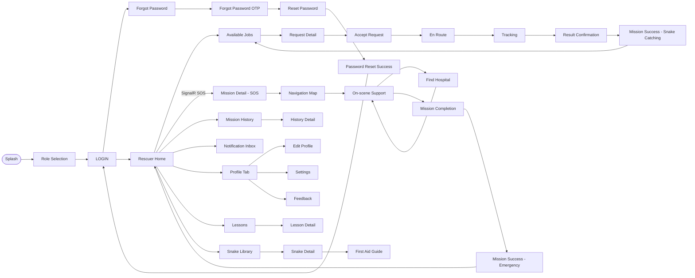

# RESCUER SCREEN FLOW — SnakeAid Mobile

**Phiên bản:** 1.1 | **Ngày:** 12/04/2026

> **Screens loại bỏ** (mock data / chưa kết nối API / không còn dùng trong flow rescuer): `History Detail` · `Income Management` · `ID Documents` · `Rescuer Registration` · `OTP Verification (registration)` · `Registration Pending` · `Registration Success`

---

## Screen Flow Diagram

---

## Screen Inventory

| # | Screen | Route | API |
|---|--------|-------|:---:|
| 1 | Splash | app start | — |
| 2 | Role Selection | `/role-selection` | — |
| 3 | Rescuer Login | `/rescuer-login` | ✅ |
| 4 | Forgot Password | — | ✅ |
| 5 | Forgot Password OTP | — | ✅ |
| 6 | Reset Password | — | ✅ |
| 7 | Password Reset Success | — | — |
| 8 | **Rescuer Home** | `/rescuer-home` | ✅ SignalR |
| 9 | Available Jobs | `/rescuer-available-jobs` | ✅ |
| 10 | Request Detail | `Navigator.push` | ✅ |
| 11 | Accept Request | `Navigator.push` | ✅ |
| 12 | En Route | `Navigator.push` | ✅ GPS |
| 13 | Tracking | `Navigator.pushReplacement` | ✅ |
| 14 | Result Confirmation | `Navigator.push` | ✅ |
| 15 | Mission Success — Snake Catching | `Navigator.pushAndRemoveUntil` | ✅ |
| 16 | Mission Detail — SOS | `/rescuer/mission-detail/:id` | ✅ SignalR |
| 17 | Navigation Map | `/rescuer/navigation` | ✅ SignalR |
| 18 | On-scene Support | `/rescuer/support` | ✅ AI |
| 19 | Find Hospital | `/rescuer/find-hospital` | ✅ |
| 20 | Mission Completion | `/rescuer/mission-completion` | ✅ |
| 21 | Mission Success — Emergency | `/rescuer/mission-success` | ✅ |
| 22 | Mission History | `/rescuer-history` | ✅ |
| 23 | **Notification Tab** | embedded in Home shell | ✅ |
| 24 | Profile Tab | embedded in Home shell | ✅ |
| 25 | Edit Profile | `/rescuer-edit-profile` | ✅ |
| 26 | **Settings** | `/rescuer-settings` | 🚧 |
| 27 | **Feedback** | `/rescuer-feedback` | 🚧 |
| 28 | Lessons | `/rescuer-lessons` | ✅ |
| 29 | Lesson Detail | `Navigator.push` | ✅ |
| 30 | Snake Library | `/rescuer/snake-species` | ✅ |
| 31 | Snake Detail | `/snake-species/:id` | ✅ |
| 32 | First Aid Guide | `/snake-first-aid/:id` | ✅ |

---

## Screen Description

| # | Feature | Screen | Description |
|---|---------|--------|-------------|
| 1 | App Bootstrapping | Splash | App startup screen that validates session state and performs initial routing. |
| 2 | Authentication | Role Selection | Screen for selecting the user role before sign-in or sign-up. |
| 3 | Authentication | Rescuer Login | Login screen for rescuer users. |
| 4 | Authentication | Forgot Password | Screen to enter account/email and start the password recovery flow. |
| 5 | Authentication | Forgot Password OTP | OTP verification screen for the forgot-password flow. |
| 6 | Authentication | Reset Password | Screen for inputting and confirming a new secure password. |
| 7 | Authentication | Password Reset Success | Screen confirming that the password has been successfully updated. |
| 8 | Home & Dashboard | Rescuer Home | Primary mission control dashboard providing daily statistics and current status. |
| 9 | Specialized Operations | Available Jobs | List interface displaying open and active snake-catching requests nearby. |
| 10 | Specialized Operations | Request Detail | Detailed view of a snake-catching request including photos and context. |
| 11 | Telemetry & Operations | Accept Request | Confirmation dialog for committing to a dispatched rescue mission. |
| 12 | Telemetry & Operations | En Route | Status screen tracking transit progress toward the target location. |
| 13 | Telemetry & Operations | Tracking | Live monitoring interface maintaining system state during an active mission. |
| 14 | Mission Closure | Result Confirmation | Validation screen for confirming caught snake quantities and species. |
| 15 | Mission Closure | Mission Success - Snake Catching | Final summary screen concluding the completion of a snake catching job. |
| 16 | Emergency Response | Mission Detail - SOS | In-depth operational view for an active SOS medical emergency dispatch. |
| 17 | Telemetry & Operations | Navigation Map | Real-time map interface mapping the optimal routing to the victim. |
| 18 | Clinical Protocol | On-scene Support | Interface detailing AI-recommended first-aid actions to perform on-scene. |
| 19 | Evacuation Protocol | Find Hospital | Directory and routing interface for locating the nearest equipped hospital. |
| 20 | Mission Closure | Mission Completion | Check-out interface for finalizing the rescue operation and capturing evidence. |
| 21 | Mission Closure | Mission Success - Emergency | Final summary screen outlining the completed SOS emergency response. |
| 22 | Activity Logs | Mission History | Chronological log displaying completed past rescue and catching operations. |
| 23 | Activity Logs | History Detail | In-depth breakdown validating operational and financial specifics of a past mission. |
| 24 | Notification Management | Notification Inbox | Centralized paginated inbox handling system alerts and read/unread tracking. |
| 25 | Account Settings | Profile Tab | Rescuer profile summary detailing performance metrics and ratings. |
| 26 | Account Settings | Edit Profile | Form interface for modifying personal rescuer details and avatars. |
| 27 | Account Settings | Settings | Application configuration interface for work modes and notification toggles. |
| 28 | Performance Analytics | Feedback | Interface for reviewing customer ratings and textual feedback. |
| 29 | Knowledge Management | Lessons | Educational hub providing modular training and procedural guides. |
| 30 | Knowledge Management | Lesson Detail | Content viewer screen for accessing specific training multimedia. |
| 31 | Knowledge Management | Snake Library | Encyclopedic database outlining snake species for field reference. |
| 32 | Knowledge Management | Snake Detail | Specific informational profile highlighting characteristics and handling risks. |
| 33 | Knowledge Management | First Aid Guide | Structured guide supplying exact first-aid procedures linked to species. |

---

## Screen Authorization

| Screen | Member | Rescuer | Expert | Admin | Operator |
|--------|:------:|:-------:|:------:|:-----:|:--------:|
| Splash | X | X | X |  |  |
| Role Selection | X | X | X |  |  |
| Rescuer Login |  | X |  |  |  |
| Forgot Password | X | X | X |  |  |
| Forgot Password OTP | X | X | X |  |  |
| Reset Password | X | X | X |  |  |
| Password Reset Success | X | X | X |  |  |
| Rescuer Home |  | X |  |  |  |
| Available Jobs |  | X |  |  |  |
| Request Detail |  | X |  |  |  |
| Accept Request |  | X |  |  |  |
| En Route |  | X |  |  |  |
| Tracking |  | X |  |  |  |
| Result Confirmation |  | X |  |  |  |
| Mission Success - Snake Catching |  | X |  |  |  |
| Mission Detail - SOS |  | X |  |  |  |
| Navigation Map |  | X |  |  |  |
| On-scene Support |  | X |  |  |  |
| Find Hospital |  | X |  |  |  |
| Mission Completion |  | X |  |  |  |
| Mission Success - Emergency |  | X |  |  |  |
| Mission History |  | X |  |  |  |
| History Detail |  | X |  |  |  |
| Notification Tab |  | X |  |  |  |
| Profile Tab |  | X |  |  |  |
| Edit Profile |  | X |  |  |  |
| Settings |  | X |  |  |  |
| Feedback |  | X |  |  |  |
| Lessons |  | X |  |  |  |
| Lesson Detail |  | X |  |  |  |
| Snake Library |  | X |  |  |  |
| Snake Detail |  | X |  |  |  |
| First Aid Guide |  | X |  |  |  |

---

---

---

## 3.4 Rescuer Portal Feature

---

### 3.4.1 Authentication
**Function trigger:** Launching the app unauthenticated, choosing role, or tapping Forgot Password.
**Function description:**
- **Actor:** Rescuer.
- **Purpose:** Let rescuer securely login or recover their password.
- **Interface:** Role selection, input forms for email/password, OTP validation, success notices.
- **Data processing:** Validation against Auth API and OTP generation.
- **Screen layout:** 
**Function details:**
- **Related Screens:** Splash, Role Selection, Rescuer Login, Forgot Password, Forgot Password OTP, Reset Password, Password Reset Success.
- **Data:** Credentials (email, password), OTP codes.
- **Validation:** Valid email format, OTP matches.
- **Business rules:** OTP expires after 5 minutes.
- **Normal cases:** Login success routes to Rescuer Home.
- **Abnormal cases:** Invalid credentials trigger error messages.

---

### 3.4.2 Rescuer Core & Notifications
**Function trigger:** Successful login or navigating from bottom tabs.
**Function description:**
- **Actor:** Rescuer.
- **Purpose:** Central mission hub routing to all major feature areas and managing notifications.
- **Interface:** Bottom navigation bar, daily stats dashboard, SOS alert modal, assignment modal, notification list.
- **Data processing:** Subscribes to SignalR streams for events, loads notifications, marks as read.
- **Screen layout:** 
**Function details:**
- **Related Screens:** Rescuer Home, Notification Tab.
- **Data:** Rescuer ID, daily stats, assignments, notification list.
- **Validation:** Authenticated session required, Rescue Mode active to receive jobs.
- **Business rules:** Notifications marked read before opening details; alerts suppressed if busy.
- **Normal cases:** Stats load successfully, correct unread dots for notifications.
- **Abnormal cases:** SignalR failure attempts silent reconnect.

---

### 3.4.3 Snake Catching Workflow
**Function trigger:** Tap "Available Jobs" in bottom navigation or accept a request from Home modal.
**Function description:**
- **Actor:** Rescuer.
- **Purpose:** Manage assigned snake-catching requests, check distance, navigate to site, capture evidence, and submit mission results.
- **Interface:** Filter pills, job card list, equipment checklist, OSRM route map, camera capture, snake species selector, fee breakdown.
- **Data processing:** Polling status every 10 seconds, calculates distance via GPS, photo uploads via media API, results submitted via mission API.
- **Screen layout:** 
**Function details:**
- **Related Screens:** Available Jobs Tab, Request Detail, Accept Request, En Route, Tracking, Result Confirmation, Mission Success — Snake Catching.
- **Data:** Assigned requests, current GPS, photos, selected catch environment, snake species list, fee breakdown.
- **Validation:** Payment must be verified before starting mission; 1 uploaded photo required to proceed; GPS required.
- **Business rules:** Job routes based on live status. Platform deducts base service fee portion. Checklist must be completed before En Route.
- **Normal cases:** Mission tracks properly, evidence uploads, fee is processed correctly.
- **Abnormal cases:** OSRM/Geolocator fails, falling back to straight-line distance; upload retries on fail.

---

### 3.4.4 SOS Emergency Workflow
**Function trigger:** Accept an SOS request alert from the Rescuer Home.
**Function description:**
- **Actor:** Rescuer.
- **Purpose:** Central control for rapid response to an emergency, navigating to the victim, providing AI support, and arranging hospital transfer.
- **Interface:** Live map navigation (rescuer & victim pins), elapsed timer, AI first aid recommendation card, hospital list, camera capture for completion.
- **Data processing:** Streams rescuer GPS, receives victim live GPS via MissionHub SignalR. Loads hospital data and AI-generated first aid content.
- **Screen layout:** 
**Function details:**
- **Related Screens:** Mission Detail — SOS, Navigation Map, On-scene Support, Find Hospital, Mission Completion, Mission Success — Emergency.
- **Data:** SOS mission details, live locations, AI recommendation text, hospital list, route polyline, evidence photos.
- **Validation:** Active GPS and MissionHub connection required.
- **Business rules:** AI first-aid tailored specific to incident's snake bite. Victim cancellation forces redirect to Home.
- **Normal cases:** Route tracks live pins, AI content loads, hospital selected properly.
- **Abnormal cases:** Victim GPS not updating retains last position; AI API error provides retry button.

---

### 3.4.5 Profile & History
**Function trigger:** Tap "Profile" or "History" bottom tabs.
**Function description:**
- **Actor:** Rescuer.
- **Purpose:** Manage rescuer identity, view past performance history, edit profile details.
- **Interface:** Profile avatar, reputation badge, history mission cards with fee summary, edit info forms.
- **Data processing:** Fetches profile info, background enrichment loop for historical requests' income, uploads new avatars.
- **Screen layout:** 
**Function details:**
- **Related Screens:** Profile Tab, Edit Profile, Mission History, History Detail.
- **Data:** Rescuer profile (name, phone, rating, completed count), terminal-status mission list, new avatar image.
- **Validation:** Form validation for changes, valid JWT.
- **Business rules:** Reputation badge changes color based on rating. Income falls back to price if actual cost unavailable.
- **Normal cases:** Profile edits save, history lists fully load with rich income data.
- **Abnormal cases:** Avatar upload failure retains old image; load errors handled securely.

---

### 3.4.6 Settings & Feedback
**Function trigger:** Tap "Settings" or "Feedback" from Profile page.
**Function description:**
- **Actor:** Rescuer.
- **Purpose:** Configure app work mode, maps, notifications, and view received customer feedback.
- **Interface:** Toggle switches for alerts, max request sliders, static rating distributions, review cards, sign-out button.
- **Data processing:** Local in-memory states for settings. Sign-out clears auth token. Feedback displays static mock info.
- **Screen layout:** 
**Function details:**
- **Related Screens:** Settings, Feedback.
- **Data:** Local preferences, auth states, static mock ratings.
- **Validation:** N/A for toggles.
- **Business rules:** Sign-out calls backend to invalidate token. Mock info used pending real integration.
- **Normal cases:** Sign-out successfully redirects to Login.
- **Abnormal cases:** Sign-out error triggers snackbar alert.

---

### 3.4.7 Knowledge Base (Lessons & Library)
**Function trigger:** Tap "Lessons" or "Snake Library" from Home layout.
**Function description:**
- **Actor:** Rescuer.
- **Purpose:** Review educational rescuer content, browse comprehensive snake library, lookup species, and view exact first-aid details.
- **Interface:** Lesson category tabs, video playback actions, search bar, species reference cards, symptom timelines, emergency CTA for first-aid.
- **Data processing:** Fetches published lessons and snake detail provider. Client-side filtering for species search.
- **Screen layout:** 
**Function details:**
- **Related Screens:** Lessons, Lesson Detail, Snake Library, Snake Detail, First Aid Guide.
- **Data:** Articles, snake details (risk level, venom, identification), structured first aid instructions, video URLs.
- **Validation:** Valid external URL for video.
- **Business rules:** CTA from specific snake navigates immediately to its custom first-aid route.
- **Normal cases:** Media functions appropriately, search runs without delay in client space.
- **Abnormal cases:** Detail API failure allows retry functionality.
