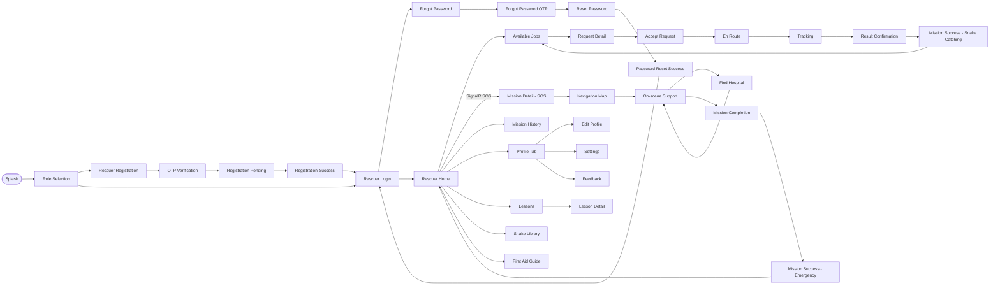

# RESCUER SCREEN FLOW — SnakeAid Mobile

**Phiên bản:** 1.1 | **Ngày:** 12/04/2026

> **Screens loại bỏ** (mock data / chưa kết nối API): `History Detail` · `Income Management` · `ID Documents`

---

## Screen Flow Diagram

---

## Screen Inventory

| # | Screen | Route | API |
|---|--------|-------|:---:|
| 1 | Splash | app start | — |
| 2 | Role Selection | `/role-selection` | — |
| 3 | Rescuer Registration | `/rescuer-registration` | ✅ |
| 4 | OTP Verification | — | ✅ |
| 5 | Registration Pending | — | ✅ |
| 6 | Registration Success | — | — |
| 7 | Rescuer Login | `/rescuer-login` | ✅ |
| 8 | Forgot Password | — | ✅ |
| 9 | Forgot Password OTP | — | ✅ |
| 10 | Reset Password | — | ✅ |
| 11 | Password Reset Success | — | — |
| 12 | **Rescuer Home** | `/rescuer-home` | ✅ SignalR |
| 13 | Available Jobs | `/rescuer-available-jobs` | ✅ |
| 14 | Request Detail | `Navigator.push` | ✅ |
| 15 | Accept Request | `Navigator.push` | ✅ |
| 16 | En Route | `Navigator.push` | ✅ GPS |
| 17 | Tracking | `Navigator.pushReplacement` | ✅ |
| 18 | Result Confirmation | `Navigator.push` | ✅ |
| 19 | Mission Success — Snake Catching | `Navigator.pushAndRemoveUntil` | ✅ |
| 20 | Mission Detail — SOS | `/rescuer/mission-detail/:id` | ✅ SignalR |
| 21 | Navigation Map | `/rescuer/navigation` | ✅ SignalR |
| 22 | On-scene Support | `/rescuer/support` | ✅ AI |
| 23 | Find Hospital | `/rescuer/find-hospital` | ✅ |
| 24 | Mission Completion | `/rescuer/mission-completion` | ✅ |
| 25 | Mission Success — Emergency | `/rescuer/mission-success` | ✅ |
| 26 | Mission History | `/rescuer-history` | ✅ |
| 27 | Profile Tab | embedded in Home shell | ✅ |
| 28 | Edit Profile | `/rescuer-edit-profile` | ✅ |
| 29 | **Settings** | `/rescuer-settings` | 🚧 |
| 30 | **Feedback** | `/rescuer-feedback` | 🚧 |
| 31 | Lessons | `/rescuer-lessons` | ✅ |
| 32 | Lesson Detail | `Navigator.push` | ✅ |
| 33 | Snake Library | `/rescuer/snake-species` | ✅ |
| 34 | First Aid Guide | `/rescuer/snake-first-aid-guide` | ✅ |

---

## Screen Description

| # | Feature | Screen | Description |
|---|---------|--------|-------------|
| 1 | Auth & Account | Splash | Entry screen that initializes app state and routes users. |
| 2 | Auth & Account | Role Selection | Lets users choose their app role before authentication. |
| 3 | Auth & Account | Rescuer Registration | Collects rescuer account details for sign-up. |
| 4 | Auth & Account | OTP Verification | Verifies registration or recovery code. |
| 5 | Auth & Account | Registration Pending | Shows approval waiting status after registration submission. |
| 6 | Auth & Account | Registration Success | Confirms registration flow completed successfully. |
| 7 | Auth & Account | Rescuer Login | Authenticates rescuer and opens main app. |
| 8 | Auth & Account | Forgot Password | Starts password recovery process. |
| 9 | Auth & Account | Forgot Password OTP | Validates OTP for password reset. |
| 10 | Auth & Account | Reset Password | Lets user set a new password. |
| 11 | Auth & Account | Password Reset Success | Confirms password reset completed. |
| 12 | Rescuer Core | Rescuer Home | Main hub with mission status and quick navigation. |
| 13 | Snake Catching | Available Jobs | Displays assigned and available snake-catching requests. |
| 14 | Snake Catching | Request Detail | Shows full details of a selected job request. |
| 15 | Snake Catching | Accept Request | Confirms job acceptance and mission start readiness. |
| 16 | Snake Catching | En Route | Tracks rescuer movement to incident location. |
| 17 | Snake Catching | Tracking | Handles on-site progress and evidence tracking. |
| 18 | Snake Catching | Result Confirmation | Reviews and submits mission result data. |
| 19 | Snake Catching | Mission Success - Snake Catching | Displays success summary for snake-catching mission. |
| 20 | SOS Emergency | Mission Detail - SOS | Shows emergency mission information and actions. |
| 21 | SOS Emergency | Navigation Map | Provides map guidance to emergency location. |
| 22 | SOS Emergency | On-scene Support | Supports on-site emergency handling workflow. |
| 23 | SOS Emergency | Find Hospital | Finds nearby hospitals for escalation. |
| 24 | SOS Emergency | Mission Completion | Finalizes emergency mission with completion details. |
| 25 | SOS Emergency | Mission Success - Emergency | Shows emergency mission completion summary. |
| 26 | Profile & History | Mission History | Lists past missions and status records. |
| 27 | Profile & History | Profile Tab | Displays rescuer profile overview and options. |
| 28 | Profile & History | Edit Profile | Updates personal profile information. |
| 29 | Profile & Settings | Settings | Manages app preferences and account settings. |
| 30 | Profile & Settings | Feedback | Collects user feedback and ratings. |
| 31 | Knowledge | Lessons | Lists training lessons for rescuers. |
| 32 | Knowledge | Lesson Detail | Shows full content of a selected lesson. |
| 33 | Knowledge | Snake Library | Provides snake species reference information. |
| 34 | Knowledge | First Aid Guide | Provides first-aid instructions for snake incidents. |

---

## Screen Authorization

| Screen | Member | Rescuer | Expert | Admin | Operator |
|--------|:------:|:-------:|:------:|:-----:|:--------:|
| Splash | X | X | X |  |  |
| Role Selection | X | X | X |  |  |
| Rescuer Registration |  | X |  |  |  |
| OTP Verification | X | X | X |  |  |
| Registration Pending |  | X |  |  |  |
| Registration Success |  | X |  |  |  |
| Rescuer Login |  | X |  |  |  |
| Forgot Password | X | X | X |  |  |
| Forgot Password OTP | X | X | X |  |  |
| Reset Password | X | X | X |  |  |
| Password Reset Success | X | X | X |  |  |
| Rescuer Home |  | X |  |  |  |
| Available Jobs |  | X |  |  |  |
| Request Detail |  | X |  |  |  |
| Accept Request |  | X |  |  |  |
| En Route |  | X |  |  |  |
| Tracking |  | X |  |  |  |
| Result Confirmation |  | X |  |  |  |
| Mission Success - Snake Catching |  | X |  |  |  |
| Mission Detail - SOS |  | X |  |  |  |
| Navigation Map |  | X |  |  |  |
| On-scene Support |  | X |  |  |  |
| Find Hospital |  | X |  |  |  |
| Mission Completion |  | X |  |  |  |
| Mission Success - Emergency |  | X |  |  |  |
| Mission History |  | X |  |  |  |
| Profile Tab |  | X |  |  |  |
| Edit Profile |  | X |  |  |  |
| Settings |  | X |  |  |  |
| Feedback |  | X |  |  |  |
| Lessons |  | X |  |  |  |
| Lesson Detail |  | X |  |  |  |
| Snake Library |  | X |  |  |  |
| First Aid Guide |  | X |  |  |  |